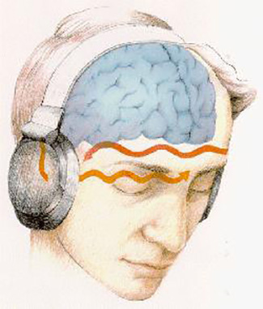
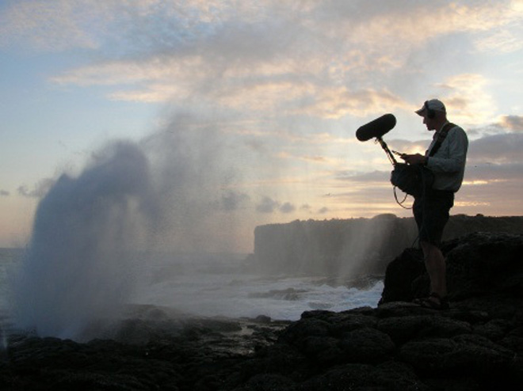
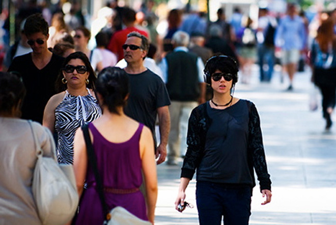
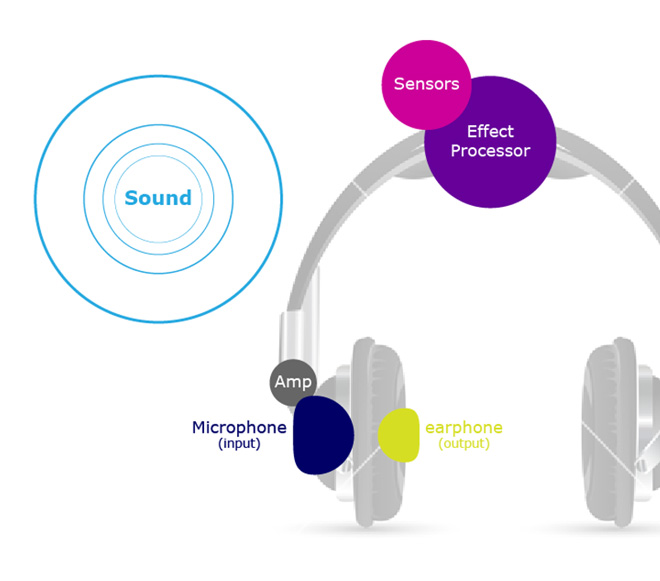
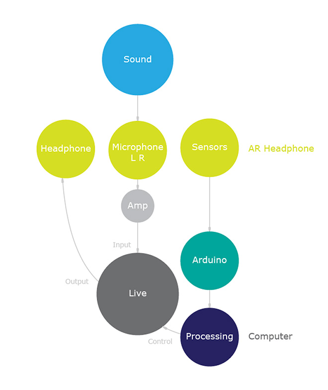
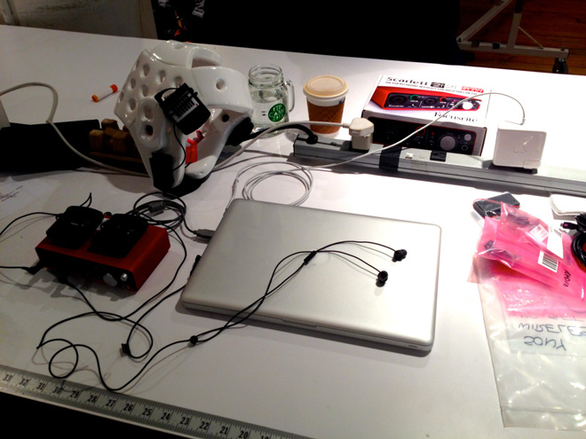
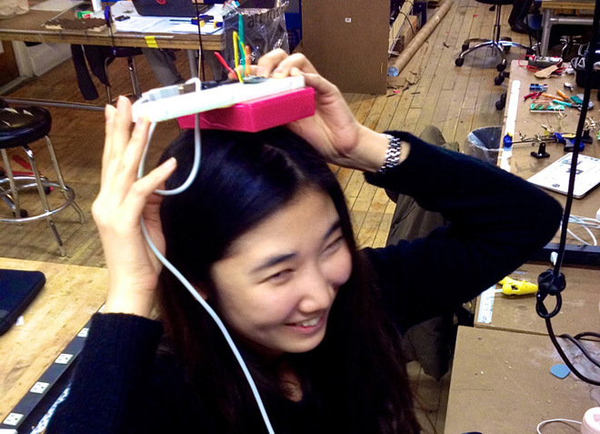
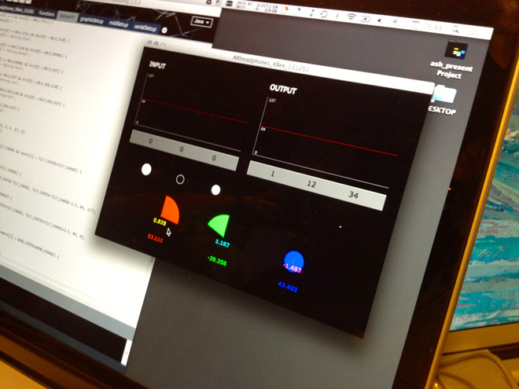
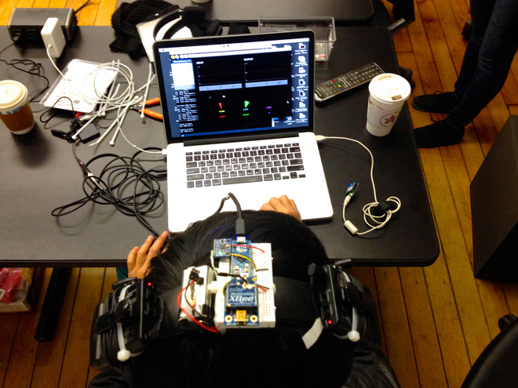
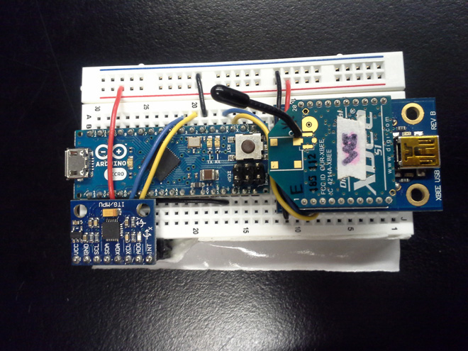

<iframe width="800" height="440" src="//www.youtube.com/embed/P7sdlLyOBAs?rel=0" frameborder="0" allowfullscreen></iframe>

<iframe src="//player.vimeo.com/video/81467415?byline=0&amp;portrait=0" width="800" height="440" frameborder="0" webkitallowfullscreen mozallowfullscreen allowfullscreen></iframe>

#### Description

  
The audio field recording experience is unique in the way that sensitive microphones together with powerful microphone and headphone preamps can create a heightened sense of sound – an augmented sound reality. As a sound engineer and designer my attention to sound is different than most people’s yet any time I have put the headphones on someone and given them the microphone and recorder to walk freely with they are always surprised by the experience and drawn deeply into the sounds around them. It’s an immersive experience and while a sound designer may have that attention to sound without the aid of the equipment, it is typical for someone unfamiliar with that level of sound amplification to have a dramatic and exciting new experience with sound.

  
The soundscapes that surround us throughout the urban landscape influences us emotionally and physically on both conscious and subconscious levels, subtly vibrating our bodies and shaping our mental landscape. It has been come the norm to shut out the soundscape with headphones by curating a private musical score to accompany or movements through the city. Listening to music as a pedestrian is a beautiful experience and has a certain transcendental quality to it but there is also something of a similar nature to be found in the sounds around us that we haven’t chosen for ourselves.

  
With the Augmented Soundscape Headphones we hope to create a user experience that bridges the experiences of the transcendental experience of a private auditory experience with an attuned awareness of the surround soundscapes. Using binaural microphone headphones, movement sensors, and audio processing the ASH will draw in the users awareness to both the soundscapes around them as well as their own movements through the landscape. The amplified environmental sounds captured by the binaural microphones will replicated the perspective of their own ears and the sensors will control subtle audio processing techniques so that the users movements will influence the sound signal they are hearing.

<iframe src="http://www.youtube.com/embed/QUM6-jty5C8?version=3&amp;rel=1&amp;fs=1&amp;showsearch=0&amp;showinfo=1&amp;iv_load_policy=1&amp;wmode=transparent" height="371" width="660" frameborder="0"></iframe>

#### Flow Chart

##### The original idea

##### The prototype

#### Development

  
Working on the binaural microphone setup

  
Testing and visualizing sensor values for our Augmented Reality Headphones

  
Observing sensor values from the 6-axis accelerometer/gyro combo sensor

  
And organizing sensor values into specific gestures to send to Ableton Live

#### Signal Path

- InvenSense MPU-6050 sensor (accelerometer and gyro gathering sensor data on body movements and gestures)
- Arduino Pro Micro (IC2 protocol from sensor)
- Two XBee radio modules – series 1 / 802.15.4 (wireless transmission of sensor values)
- Processing sketch with sensory values visualized and organized into gestures (receiving sensor values through serial connection from XBee)
- Ableton Live project with sensor values mapped to various audio filters (midi communication from Processing and audio from two wireless lavalier microphones through a two-channel USB audio interface)
- Processed sound transmitted wirelessly to a bluetooth receiver connected to the headphones.

#### Audio Filters

- Tilting Head Left & Right: Sound follows in the stereo field with the track pan control.
- Tilting forward: Sound emulates diving underwater or blood rushing to head using three different types of high cut filters.
- Tilting back: Sounds fade away into a bell-like drone using the metal beam mode of an effect that simulates the acoustic characteristics of resonant objects.
- Turning Head Left and Right: Sound repeats rhythmically using a pong delay effect.
- Walking / Running / Jumping: Sound becomes increasingly thunderous using a high cut filter with a dynamic sub bass boost giving movement to the low end.

#### Further Development Goals

- Decrease the delay when receiving sensor values over XBee.
- Reduce the size/weight of the headphones.
- Fine tune the audio filters and sensor mapping to better suit movements.
- Pair ASH with Oculus Rift for immersive three-dimensional sound/vision.

#### Other
