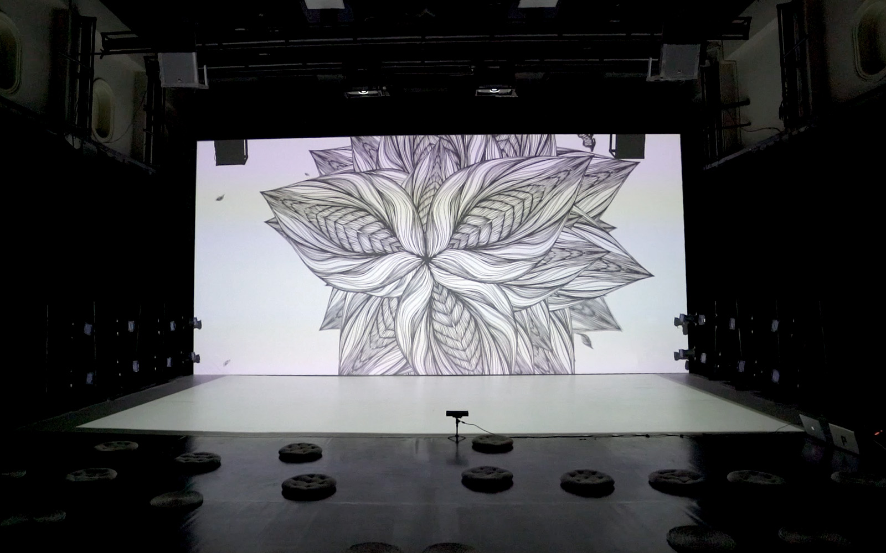
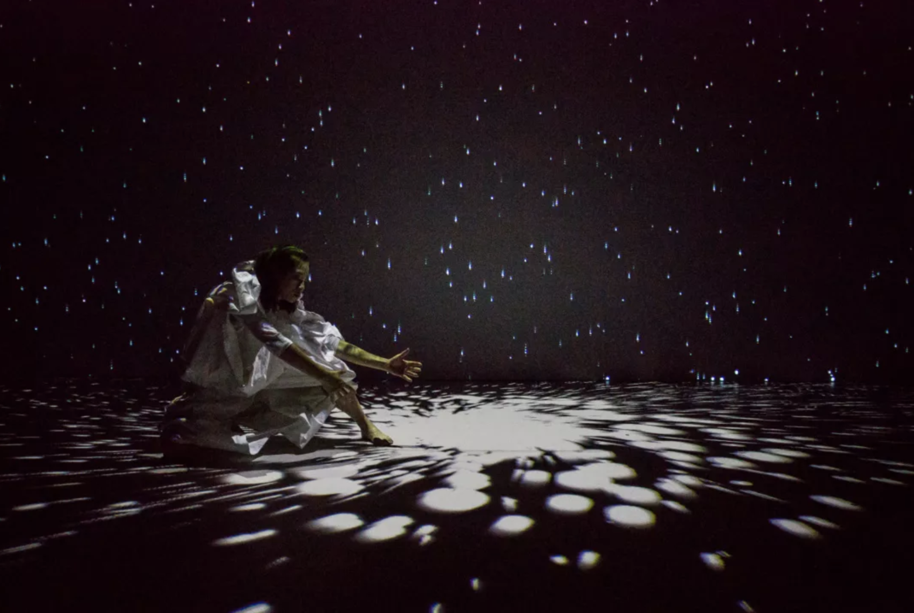
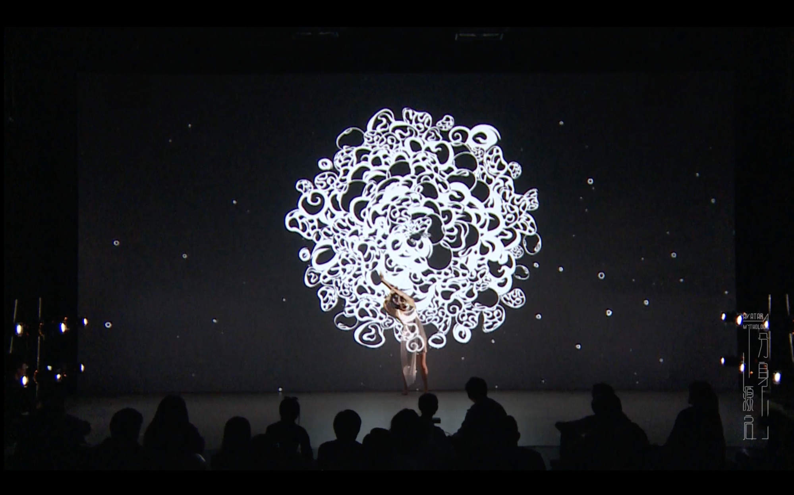
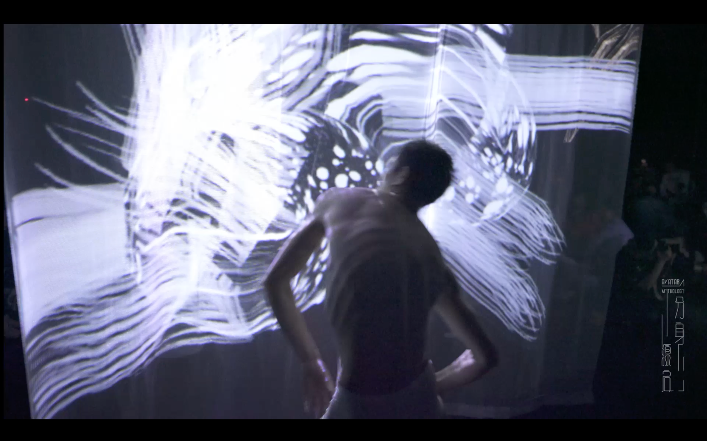
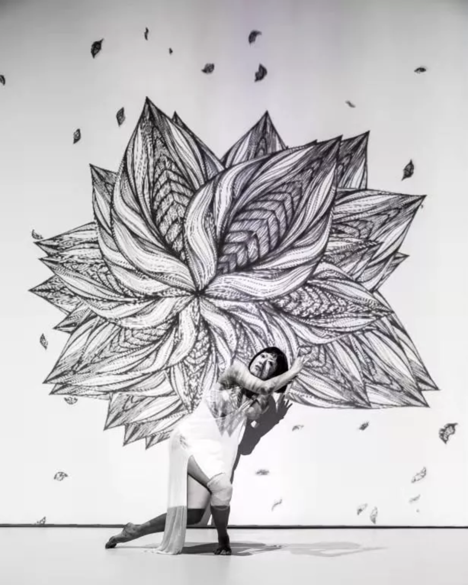
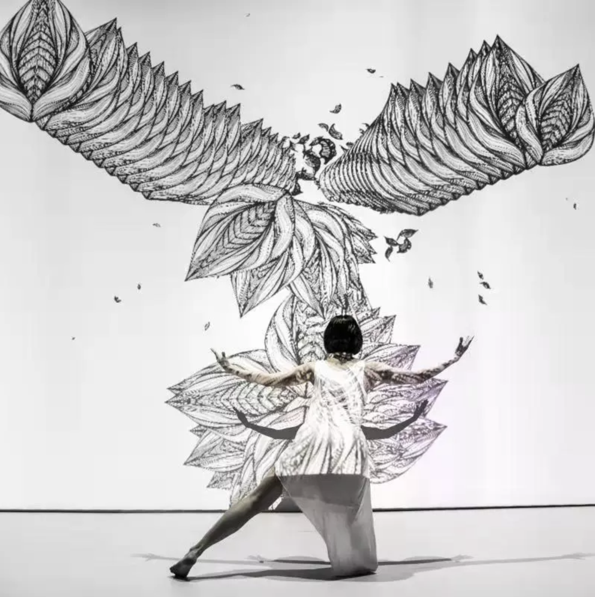
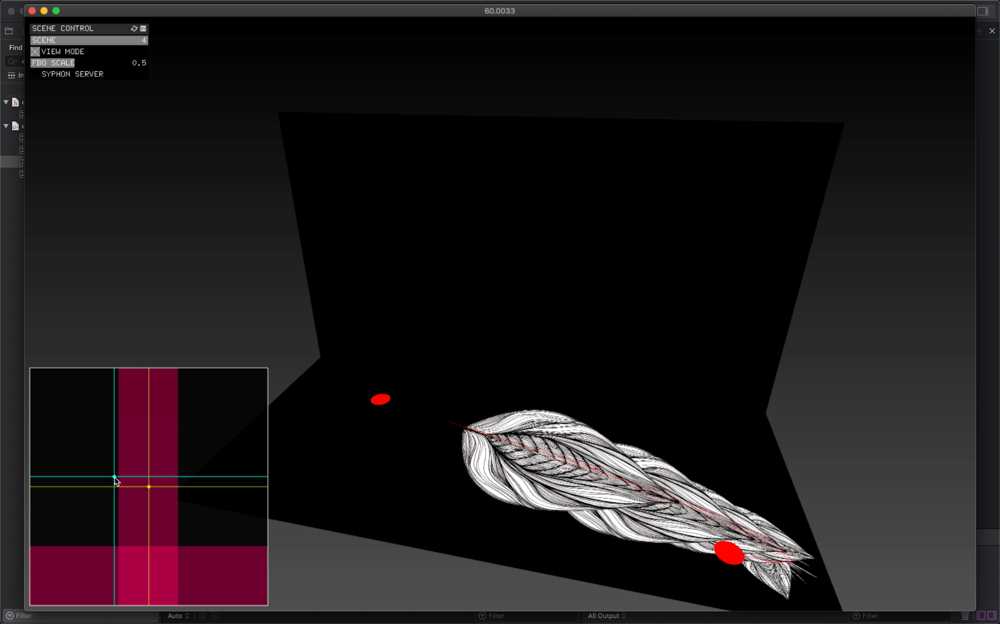
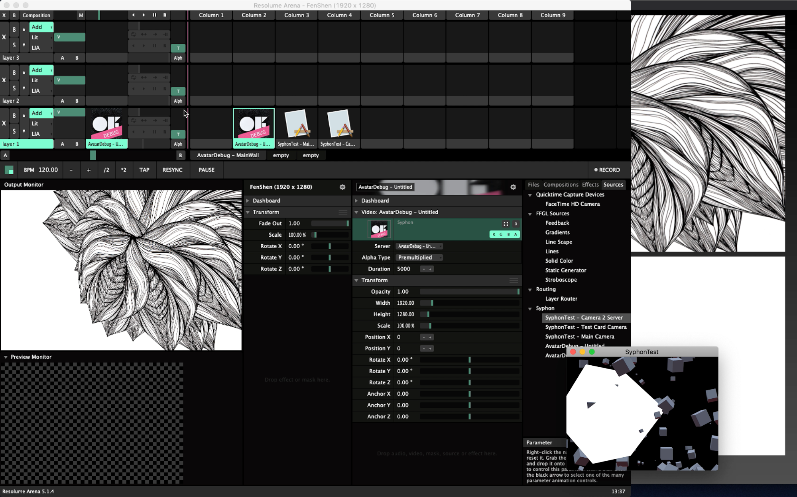
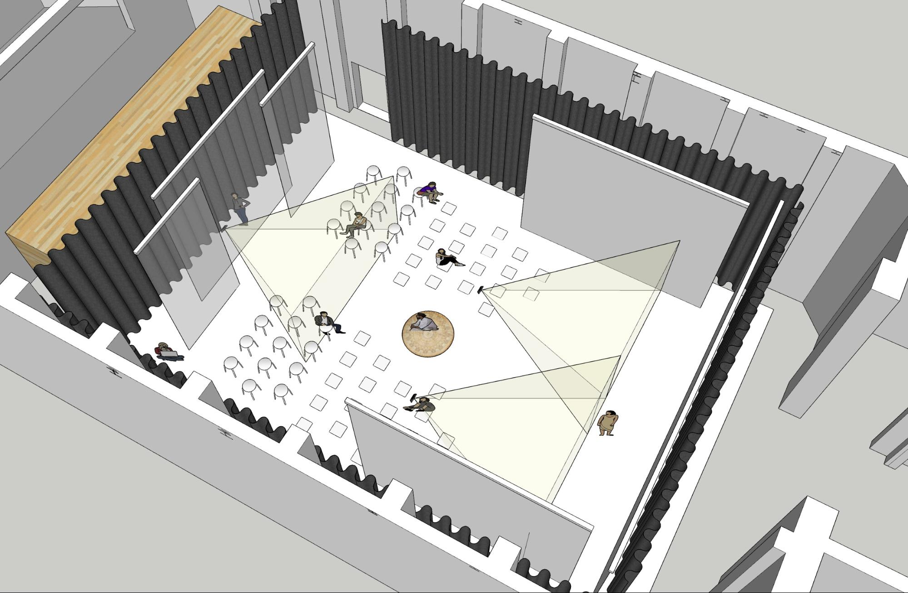
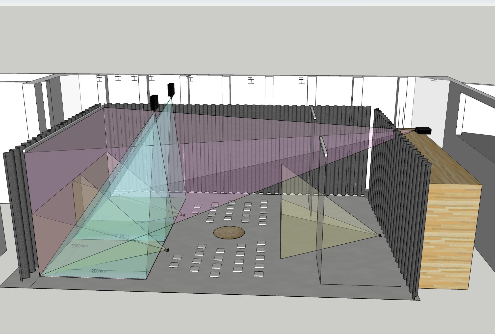

<iframe width="800" height="450" src="//www.youtube.com/embed/Wl_59HQjO3M?feature=player_detailpage" frameborder="0" allowfullscreen></iframe>

<iframe width="800" height="450" src="//www.youtube.com/embed/mPm63bvD778?feature=player_detailpage" frameborder="0" allowfullscreen></iframe>

### Project Overview

**Venue**: New Space Theatre, Shanghai Theatre Academy, Shanghai, China  
**Collaborators**: Zhang Yinan (Tongji University), Li Yuejuan, Jess Chiayi Seetoo (Shanghai Theatre Academy), Zoe Yu-Chien Cheng

The project premiered in the 2019 China Shanghai International Arts Festival as “The Rising Artists’ Works.”

Drawing on the worldview of _Shan Hai Jing_ (Classic of Mountains and Seas), a Chinese classic text of mythic geography and beasts, we instill contemporary, philosophical contemplations into a newly conceived story. Against the mythical backdrop is the idea of “avatar,” or modes of “alter-being,” through which we elaborate the inner journey of human beings coming to terms with the unknown: the birthing of life, the struggle for survival, the revelation via love, hate, and fear, and the ultimate transcendence and release with inner peace.

If the mythical world filled with Eastern totemic symbols represents the birthing of the unknown, the “beasts” that are the “alter-beings” of humans visually render our inner complexes. This piece combines semi-immersive space design with multi-medial visuals to let the audience inhabit the “unknown” and experience their “alter-beings” with the dancers as we journey into the mysteries of life.

In correspondence, the digital media design features technological “avatars” by way of motion capture, interactive animation, and remote control, linking backstage manipulation with front-stage performance. With these all-permeating technological “avatars” as metaphorical “alter-beings,” the performance also embodies the merge between modern technology and traditional arts.

### Conceptual Exploration

As mentioned above, the performance was inspired by Shan Hai Jing, an ancient text featuring "weird" and "strange" creatures and surreal landscapes. We aimed to create an improvisational performance where dancers and imaginary creatures encounter each other, exploring emotions and reactions.

When applying motion tracking, I introduced and explored diverse ideas about how avatars could behave differently from human bodies and how dancers would react to it. For example, what happens if an avatar's arm is three times longer and more elastic than a real arm? How would such a body move and express emotions if the legs were much shorter and the neck three times longer?

Yinan and I also performed live as creative coders. We developed our own systems and interfaces to control the creatures in real-time, making the performance more collaborative and improvisational between dancers and media artists.

Minimal environmental visuals, drawn live by a painting artist, acted as dynamic prompts. The dancers responded improvisationally, forming spontaneous connections between physical and digital elements.

I worked with the main collaborators to develop initial ideas and sequences. I brought perspectives as a media artist to help choreographers integrate interactive media. I also led discussions with dancers about how to respond to the digital elements during rehearsals.

### Technical Development

The visuals were created algorithmically using OpenFrameworks. Most elements were adjustable in real time through the custom interface I designed. In the later part, custom 3D models were rigged in Unity and controlled via OSC using an iPad.

I focused on building a technical framework that brought together collaborators from different fields. I engaged in discussions to translate conceptual or technical ideas into dance, visuals, sound, interactive media, and stage design.

I planned and tested stage setups through 3D modeling and designed projection mapping layouts to create semi-immersive environments.

I designed creatures inspired by Shan Hai Jing to represent abstract ideas and emotions. I built a custom interface to control these creatures in real time during performances. Motion capture systems allowed the avatars to synchronize with dancer movements. Projection mapping and semi-immersive visuals enhanced spatial depth and drew the audience further into the performance.

I managed real-time media control through Arena Resolume to ensure smooth transitions and effects. I worked closely with designers, programmers, and the sound team to integrate visuals, choreography, and music. Special focus was given to synchronizing soundscapes with visual elements to create a unified experience.

### Result & Recognition

The project was well-received by the audience and critics. It was featured in various media outlets and received positive reviews. [WeChat Article](https://mp.weixin.qq.com/s/QxN-pPdxsOR80YqNevGGOg), [CGTN Interview](https://news.cgtn.com/news/2019-10-23/New-media-drama-Fusing-modern-technology-and-traditional-art-L1rGAygL8Q/index.html)

#### Highlights

An opening scene that implies accumulated energy from the environment.

A scene that represents the birth of life and the unknown.

A stage setup at the back where dancers and avatars interact. Various creatures were projected on the translucent screen.

**Real-time Motion Tracking**

The creature first appears as a plant-like form.

The creature evolves into a bird-like figure and mimics the dancers' movements.

**Custom Interface**

A custom system was developed to manipulate the creatures during the performance. The interface was designed to easy to use with the Apple Trackpad, allowing for finger gestures to control the creatures.

**Projection Mapping Interface**

Utilizing Resolume Arena, multiple cues were set up to control visuals and effects in real time. It was also used for projection mapping.

**Stage Mock-ups**

Multiple 3D model mock-ups were created to visualize the stage setup, projection mapping snd sensing areas.

### Credits & Acknowledgments

- Producer: Zhang Yinan
- Director: **Jung Hyun Moon**
- Art Director: Li Yuejuan
- Choreographer & Dancer: Chiayi Jess Seetoo, Yu Chien Cheng, Zheng Lingmin
- Media Art: **Jung Hyun Moon**, Zhang Yinan, Zhou Xing, Cao Yanbin, Bin Xue
- Music Composition and Sound Design: Jung Min Moon
- Music Performance: Paul Yip
- Stage Manager December Yang
- Costume: Sophia Zhao
- Lighting: Li Mingfang
- Project Assistant: Liu Zhao
