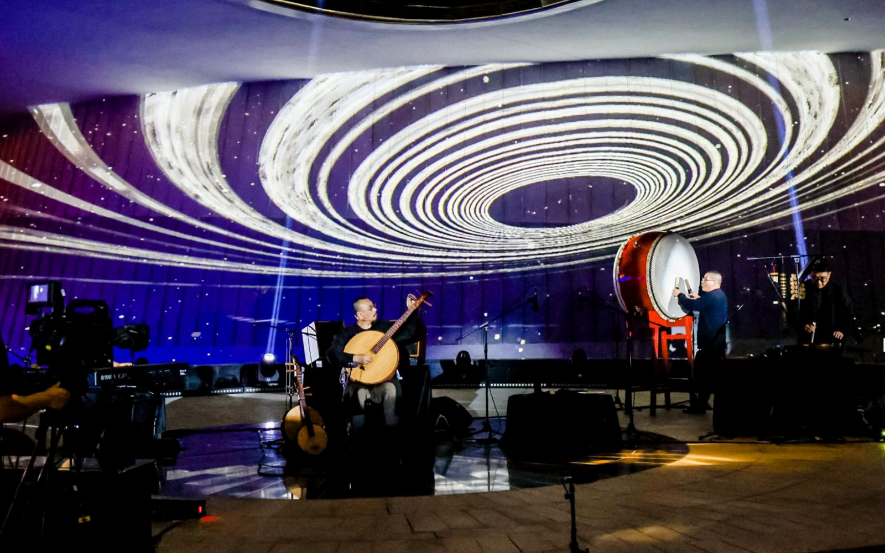

- **Venue1**: [Shanghai Planetarium (Shanghai Astronomy Museum)](https://www.ennead.com/work/shanghai-astronomy-museum), Pudong, Shanghai, China
- **Collaborators**: [Feng, Mantian](https://www.ichongqing.info/2021/01/11/chongqing-interview-series-feng-mantian-my-whole-life-and-ruan/), - [inCulture](https://drive.google.com/file/d/13gSf4sPv7_VBIrPLSjFgc7P4I8J0K40U/view?usp=sharing)

<iframe width="800" height="450" src="//www.youtube.com/embed/WxhK6FOfil4?feature=player_detailpage" frameborder="0" allowfullscreen></iframe>

#### Contribution Details:

I had the opportunity to collaborate with Chinese Moon Guitar master Feng Mantian and the creative organization inCulture. My responsibilities included:

- Media settings such as lighting and sound system configuration.
- Drafting a 3D simulation of the space to evaluate specifications for equipment (e.g., four 30,000 lumens projectors).
- Developing 30+ interactive visual scenes using particle systems and video footage.
- Tools used: **Three.js** and **Resolume**.

## Supplementary Photos:

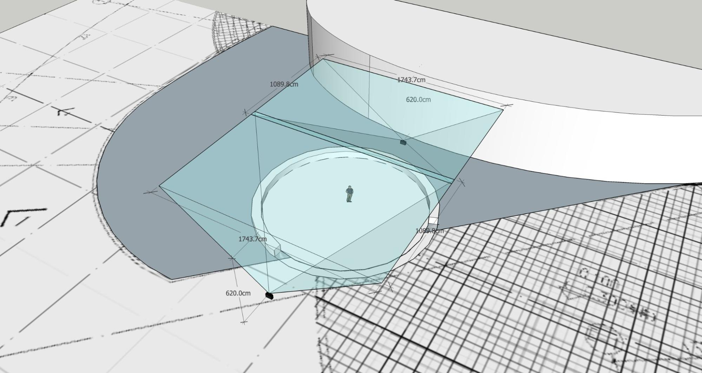

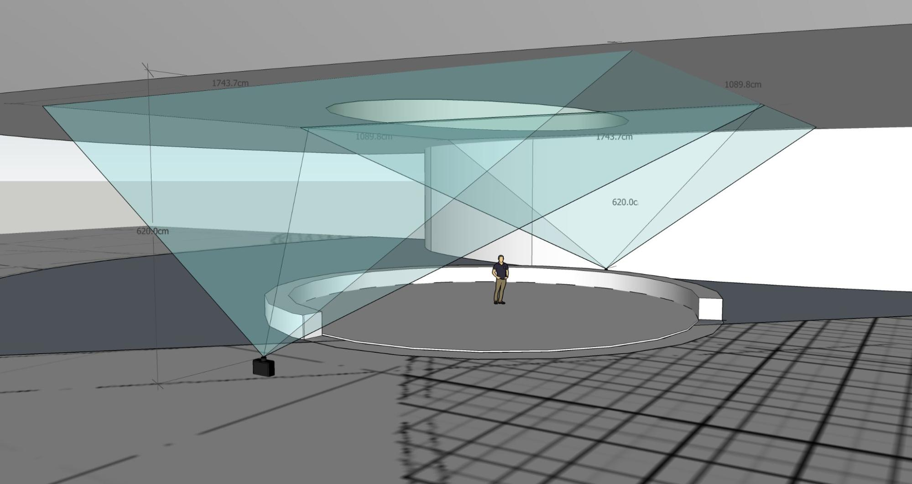

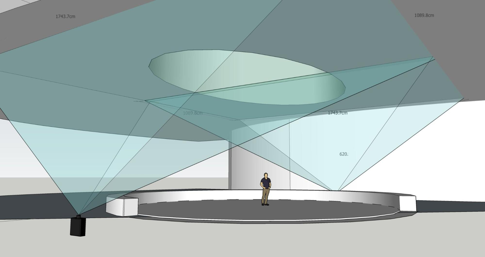

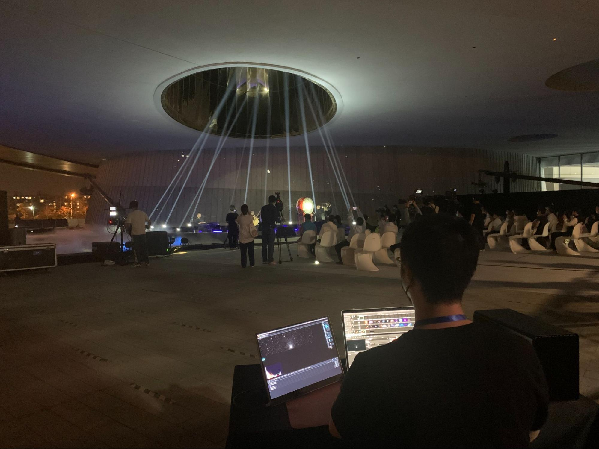

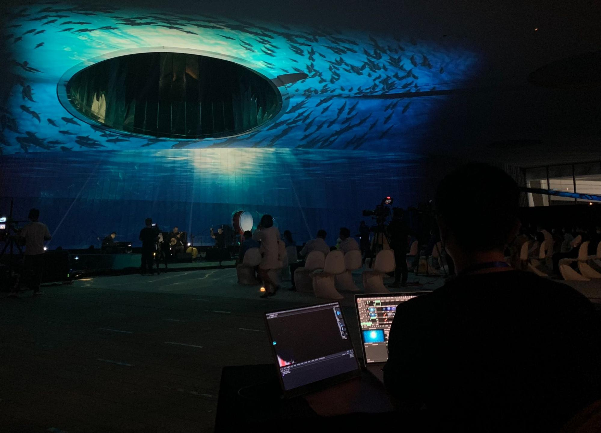

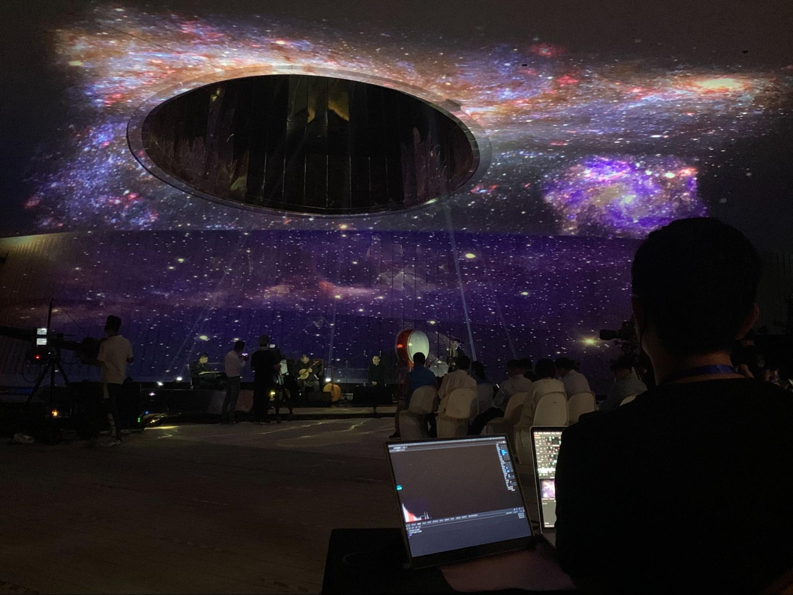

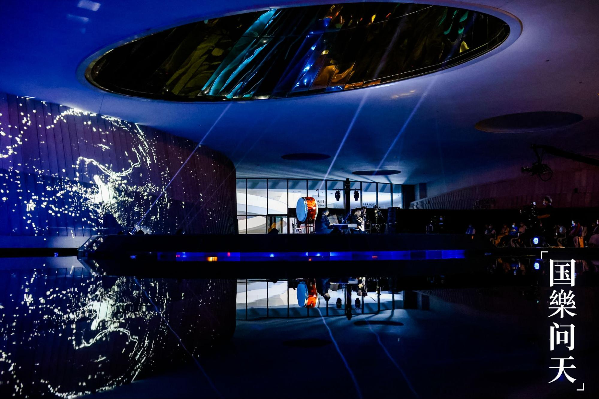

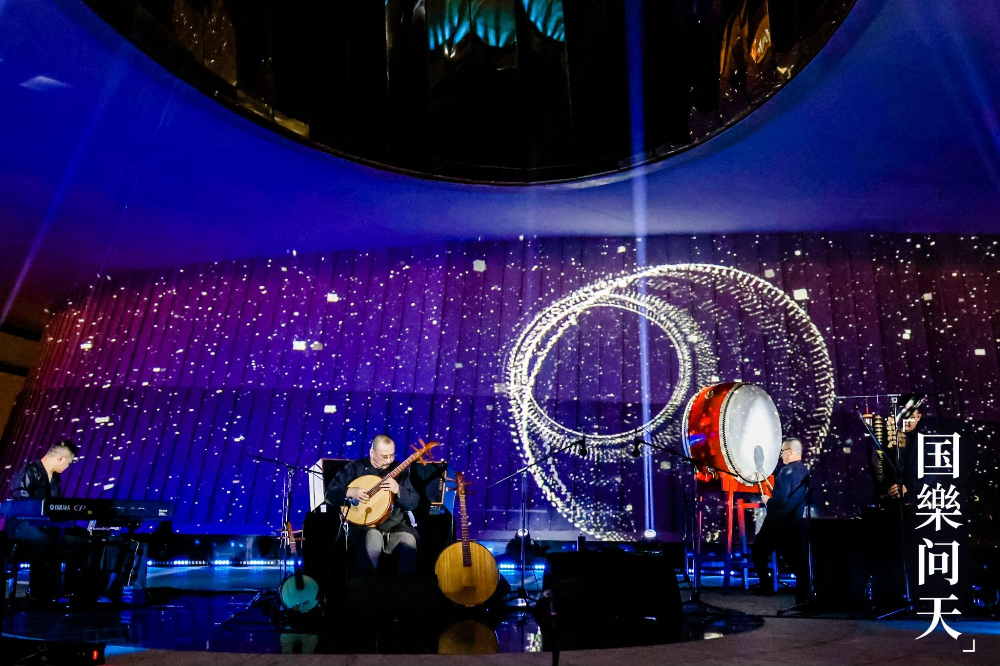

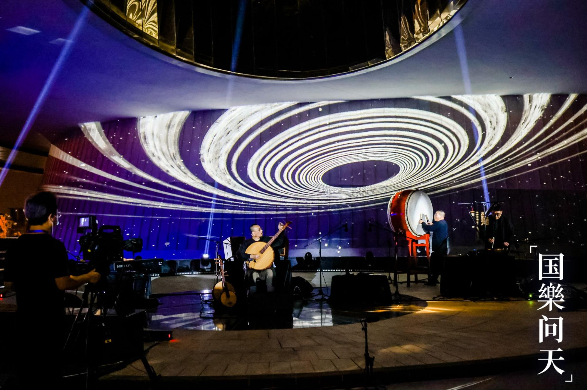

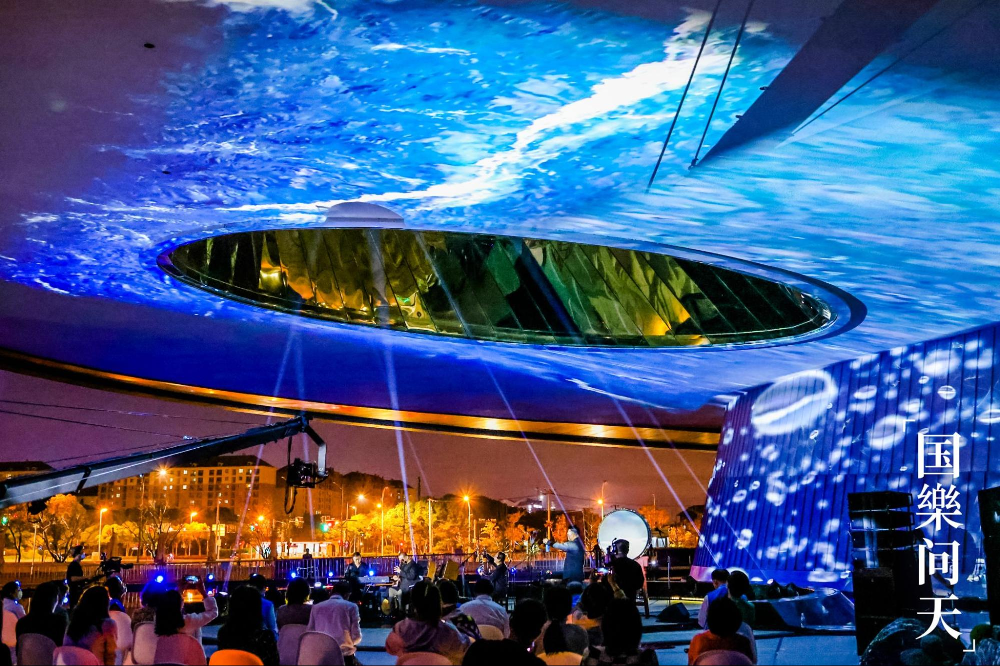
