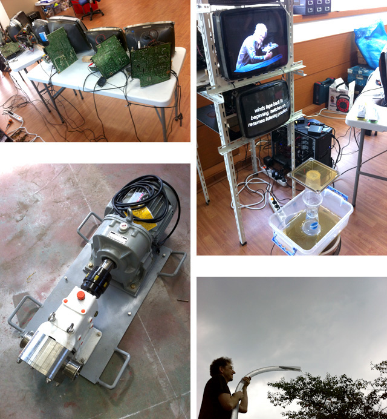
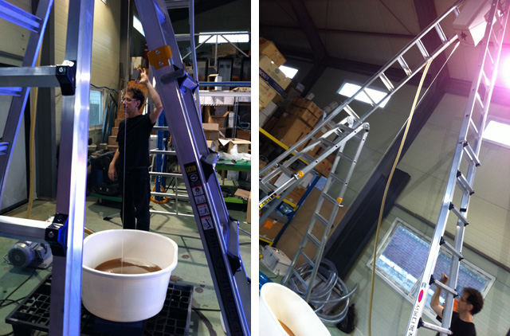
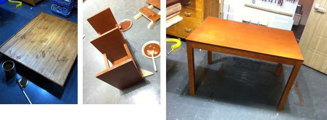
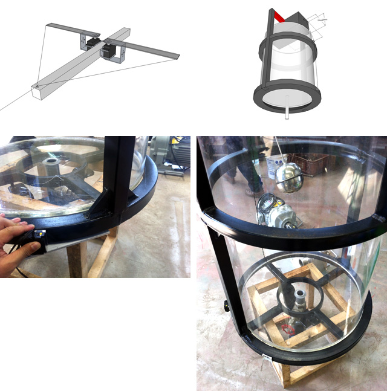
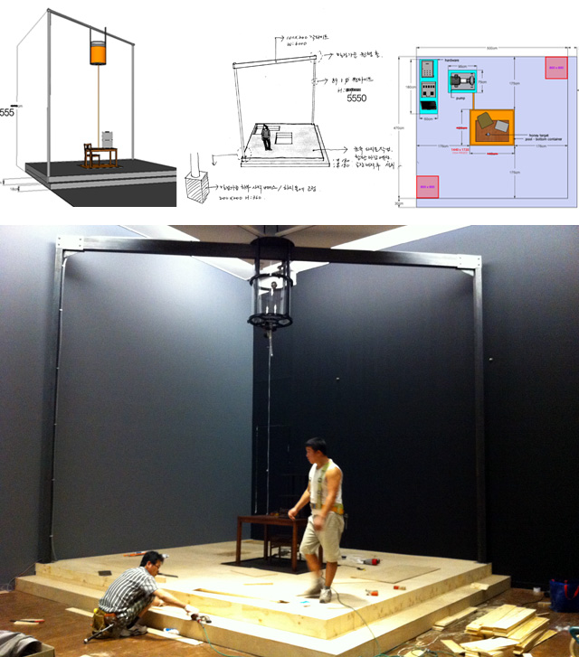
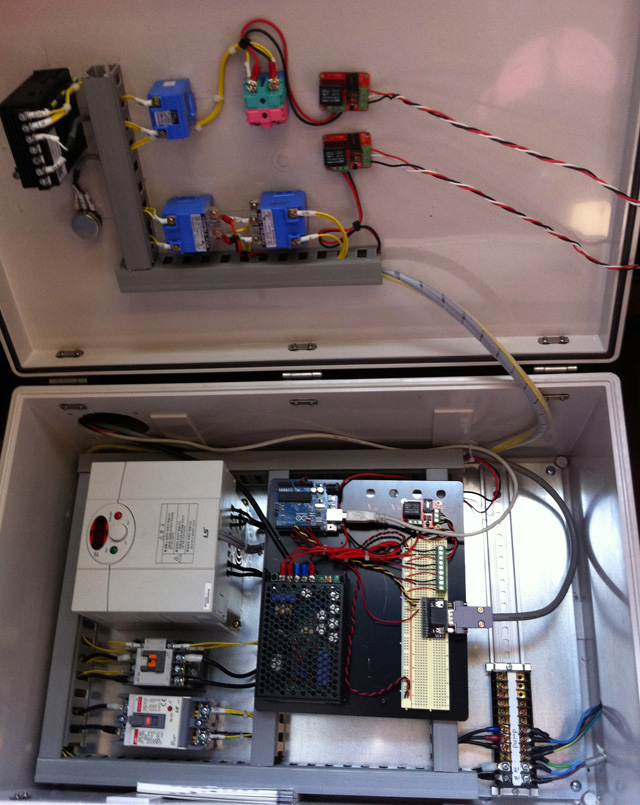

<iframe src="http://player.vimeo.com/video/57201828?portrait=0" width="800" height="440" frameborder="0" webkitAllowFullScreen mozallowfullscreen allowFullScreen></iframe>

## Work Process

CRT disassembly and re-arrangement

Pump and the power test

Honey flow test from 5m height

Carpentering and staining

Designing the mechanism of the top container

Construction of the metal frame and the stage

Pump Automation Circuit (Arduino, Processing)

