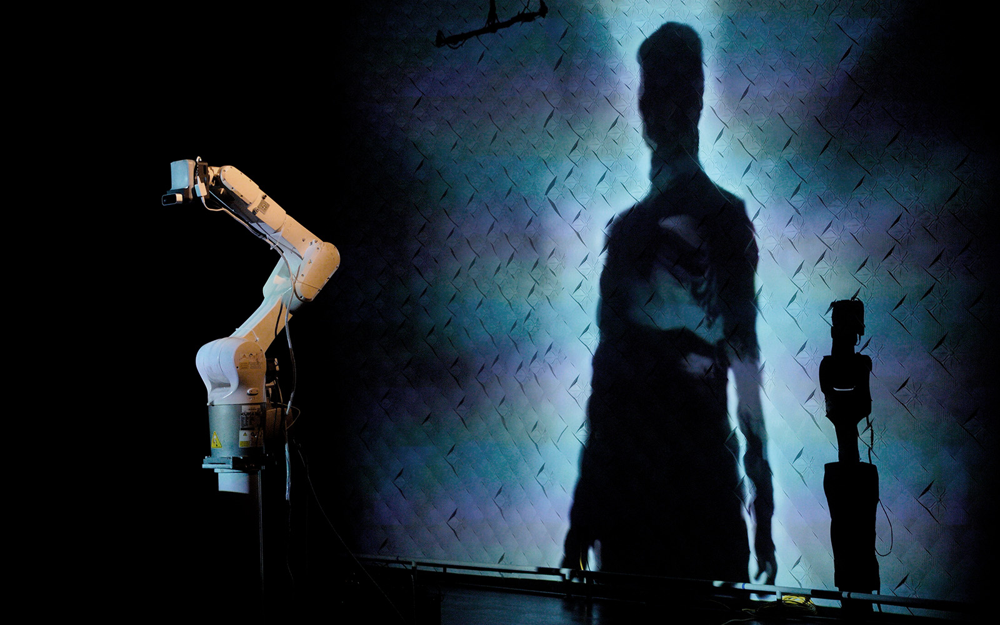
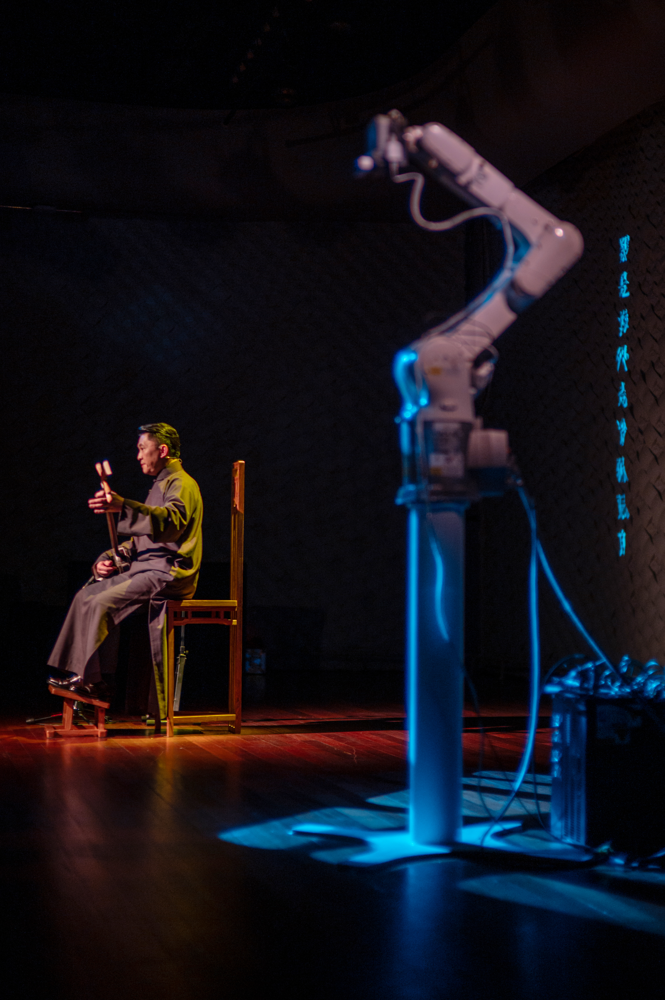
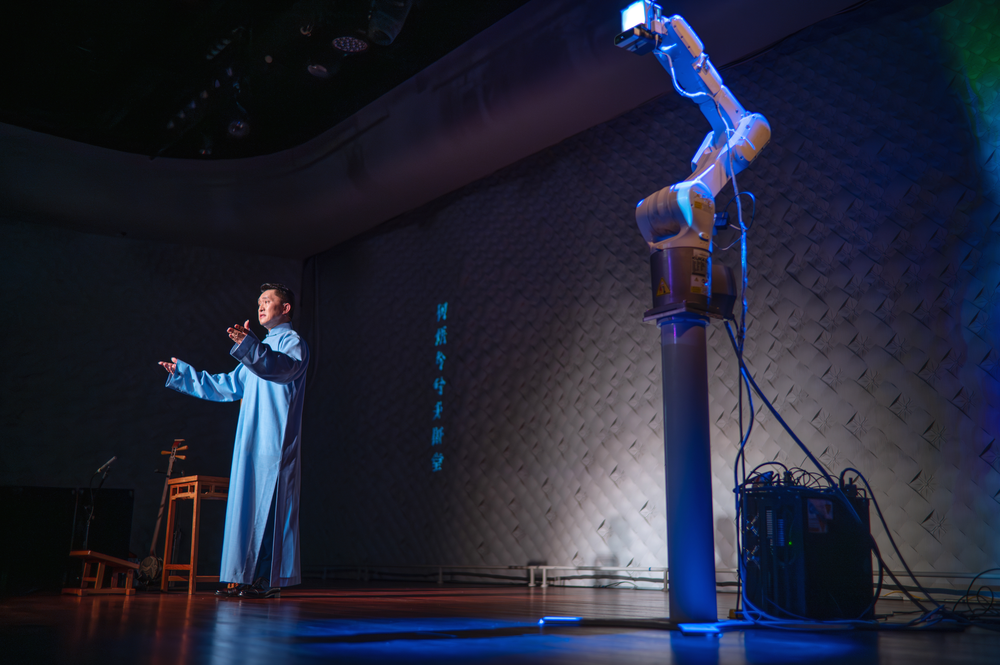
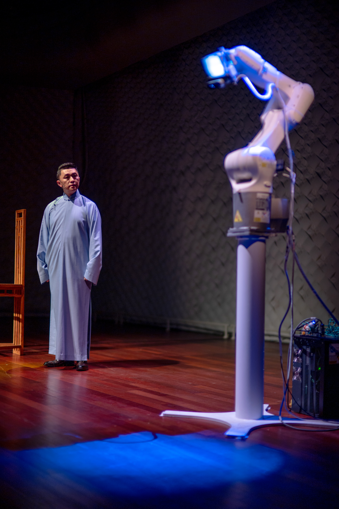
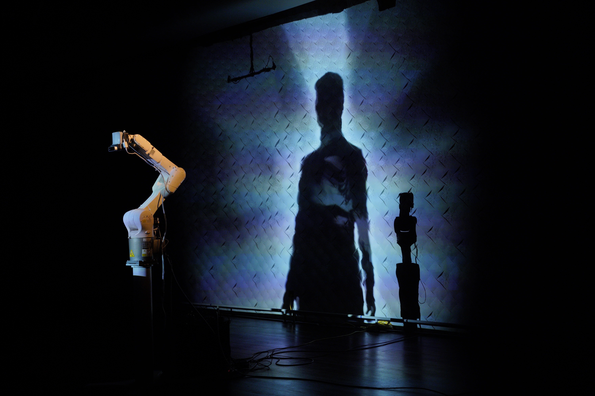
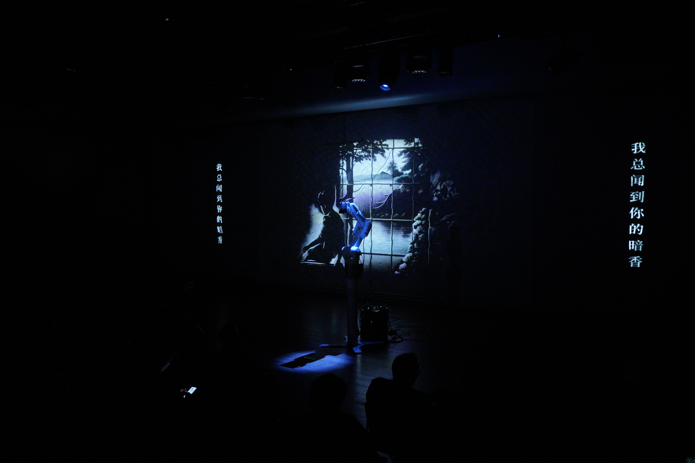
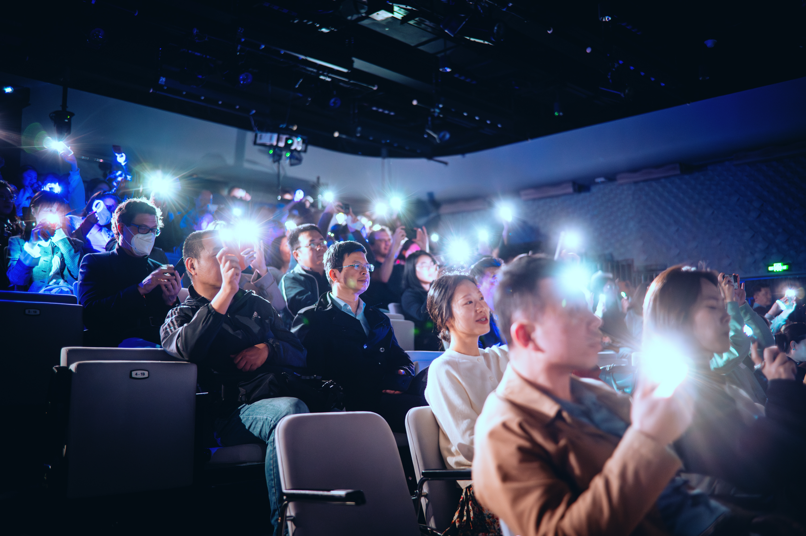

**Venue**: [Shanghai Concert Hall](https://www.shanghaiconcerthall.org/), Shanghai, China  
**Main Collaborators**: Zhang Yinan, Zheng Kangyi, Li Yuejuan

### Project Overview

"Melodic Echo Odyssey" is an experimental narrative concert that merges artificial intelligence, digital art, and new media technologies to reinterpret historical records and revive cultural memories. This project blends AI-generated music, dynamic visuals, and interactive elements to craft an immersive journey through time and tradition.

The performance incorporates Chinese cultural heritage, [Pingtan](https://en.wikipedia.org/wiki/Suzhou_Pingtan), combining AI-generated visuals and soundscapes with traditional influences to create a distinctive experience. An innovative segment featuring a robotic arm demonstrates advanced real-time interaction, integrating computer vision, machine learning, and robotics to deliver a technically precise and creatively engaging performance.

<iframe width="800" height="450" src="//www.youtube.com/embed/Jy67K_ND3QQ?feature=player_detailpage" frameborder="0" allowfullscreen></iframe>

### Conceptual Exploration

Inspired by the timeless appeal of [Pingtan](https://en.wikipedia.org/wiki/Suzhou_Pingtan) and the cultural legacy of Shanghai and Suzhou, this project envisions a dialogue between past and future. Drawing from historical archives and modern technologies, it bridges eras through the language of music, exploring themes of memory, identity, and transformation.

While AI-generated imagery initially offered exciting possibilities, it also revealed certain limitations. Early outputs were often random and lacked coherence, making it difficult to align them with specific artistic concepts. Moreover, audiences quickly grew less impressed by AI-generated visuals, describing them as no longer "enchanting." In response, we sought to use AI more intentionally, integrating cultural elements to create richer and more meaningful outputs. This approach resulted in more cohesive and impactful visual narratives, suggesting deeper cultural values. We aimed to reimagine and elevate Pingtan's (historically underappreciated) cultural significance using AI.

Our exploration continued to imagine how a robot might perceive itself upon being reborn through AI. We discussed key questions: How might it become aware of its thoughts, recognize its body, observe its surroundings, and rediscover its ability to sing? These reflections guided our technical development, emphasizing the robot's process of self-awareness and interaction with the world around it.

Finally, we aimed to blur the boundaries between the robot and audiences. The AI could see and perceive them, enabling indirect participation in the performance. This interaction allowed audiences to feel involved in the narrative.

### Technical Development

The technical framework utilized AI to reinterpret historical records and reshape cultural soundscapes. Multiple generative AI tools were employed to create and manipulate visuals and sound. Computer vision and AI further enhanced visual processing, enabling dynamic responsiveness during performances. Robotic arm movements were pre-programmed using Rhino and triggered during the performance. These presets were synchronized with other media and interactive elements to ensure cohesion.

My primary role focused on integrating and operating various technical components such as AI-generated content, robotic movements, and real-time processing. Custom interfaces were developed for real-time interaction. A new subtitle system was implemented to adapt dynamically to the evolving narrative, improving synchronization between visual and audio elements.

### Highlights

### Credits & Acknowledgments

- Producer: Zhang Yinan
- Director & Artistic Director: Li Yuejuan
- Scriptwriter & Stage Supervisor: Liu Jing
- Performer: Bowen Gao
- Media and Technology Operation: **Jung Hyun Moon**
- Interactive System Development: **Jung Hyun Moon**
- Robotic Arm Development: Zheng Kangyi
- Project Coordinator: Zhang Ruoyu
- AI Technology Support: Guo Weiwei
- Cultural Advisors: Yan Banzhi, Yun Jiayan, Ding Xia, Chen Yixin
- Calligraphy Creation: Ye Jiayi
- Lighting Design: Shen Yun
- Lighting Execution: Hou Yinzhu
- Costume and Makeup Consultant: Zhuo Yanran
- Design and Development Team: Cao Yanbin, Wang Ziyu, Tian Yanrong, Fu Yutong, Shi Lujun, Wang Yio, Hu Dingxin, Zhao Xiaoyu, Liu Kexin, Liu Wenyi, Zhu Ziyan
