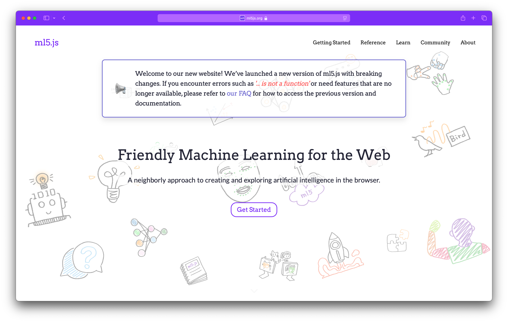
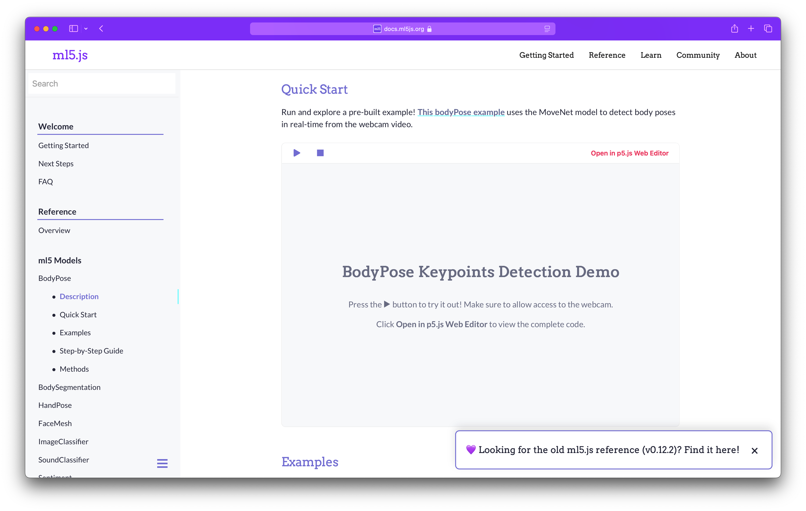

Link To the Website: [ml5.js](https://ml5js.org/)

### Improving ml5.js Pedagogy and Accessibility

in collaboration with [the development team](https://ml5js.org/about/)!

[ml5.js](https://ml5js.org/), initiated by Daniel Shiffman at NYU in New York, is an open-source approach to democratize artificial intelligence exploration in the browser. The library leverages the web platform for its wide accessibility and utilizes JavaScript as its primary language, aligning with the trend of beginner programmers learning through tools like p5.js. ml5.js empowers users to engage with AI concepts, fostering innovation in fields such as art, design, and human-computer interaction. Its significant global impact is evident through its local integration into numerous courses and student projects at NYU Shanghai's Interactive Media Arts (IMA) department ("Machine Learning for New Interfaces", "Make Art with AI", "Web Page To Web Space", and "Machine Learning for Artists and Designers"), enhancing the learning experience and encouraging creative exploration in AI.

ml5.js faces various challenges, including outdated models, inconsistent APIs across models, limited documentation - at times unapproachable to beginners, and a website built on an outdated and inflexible backend. All of which hinder its ability to better serve AI education and creative exploration.

**The goal of this project** is to advance ml5.js with a strong emphasis on human-centered artificial intelligence (AI). The project involves updating the ml5.js library **for relevance and accessibility, improving the API for beginners, and bridging AI/ML with education and creative realm to encourage innovation through approachable pedagogical strategies.** The outcomes include contributing to an updated ml5.js library, a redesigned website, expanded example codes and tutorials, all of which aim to make AI more accessible to a broader audience, empowering individuals from diverse disciplines to harness its potential for innovative and human-centered applications.

I have led the development of the website, **integrating pedagogical approaches** and **interactive learning experiences**. I also contributed to the development of the ml5.js library, focusing on improving the API and documentation for beginners. The project is ongoing.
