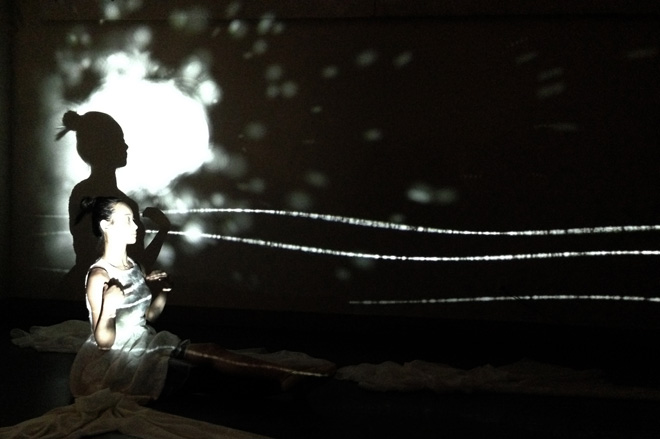

<iframe width="660" height="441" src="//www.youtube.com/embed/5imT-TdKZQc" frameborder="0" allowfullscreen></iframe>

The Nature of Water is a dance performance based on a Chinese proverb that literally means “The water that bears the boat is the same that swallows it.”

It is a performance, that, through interactive sound and video, gives audience an experience that transitions from calm to playful to violent, to show the different personalities of ‘water’.

What the proverb really conveys is that if something is used correctly, it will be of benefit; if misused, it will do harm. Here, the dancer portrays this behaviour through different dance styles, and the surroundings mimic her dancing. Initially, we see that everything is harmonious..the dancer, the music and elements controlled by the dancer herself; that is, the water and life created by water. As we move forward, this creation of water gets abused by water, ultimately resulting in destruction of the creation.

The performance prompts us to not take everything in life for granted; to not misused but rather respect them.
