Artistic Assistant for Romy Achituv's' _Ash and Hush_, 2013 and _Krapps Last Tape_, 2012.

## Ash and Hush (2013)

<iframe src="//player.vimeo.com/video/83819049?portrait=0" width="800" height="440" frameborder="0" webkitallowfullscreen mozallowfullscreen allowfullscreen></iframe>

## Krapp's Last Tape (2012)

<iframe src="http://player.vimeo.com/video/57201828?portrait=0" width="800" height="440" frameborder="0" webkitAllowFullScreen mozallowfullscreen allowFullScreen></iframe>

### Work Process: Ash and Hush (2013)

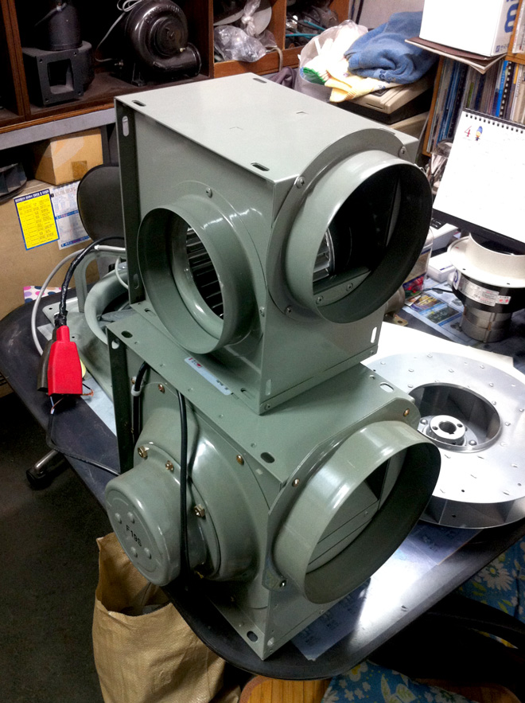

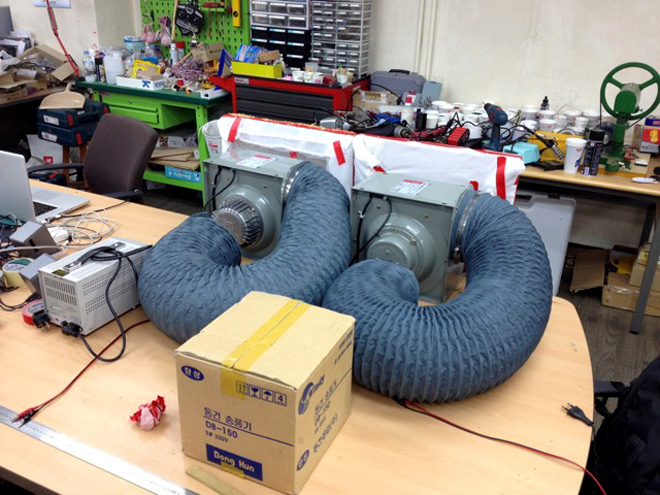

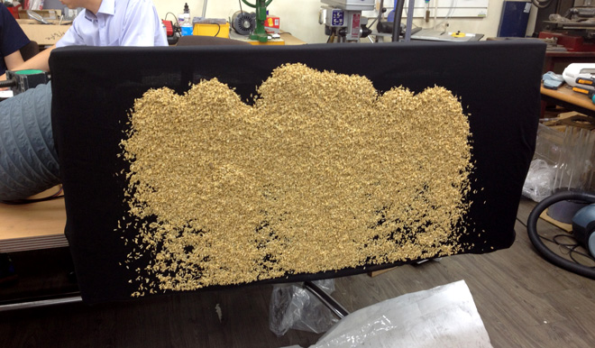

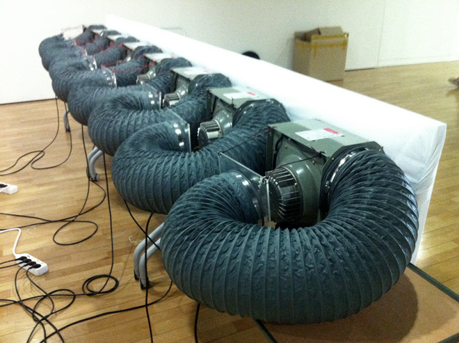

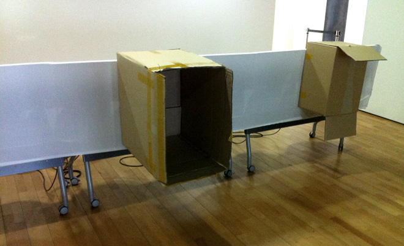

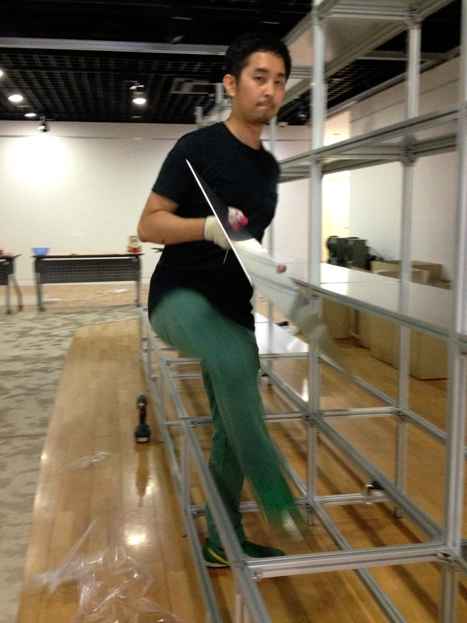

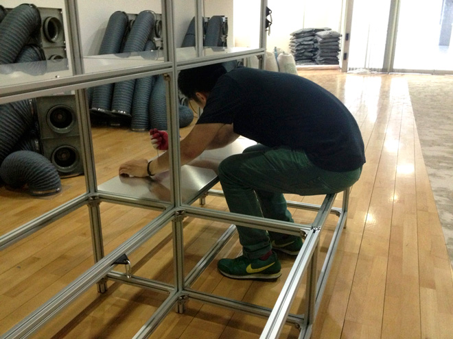

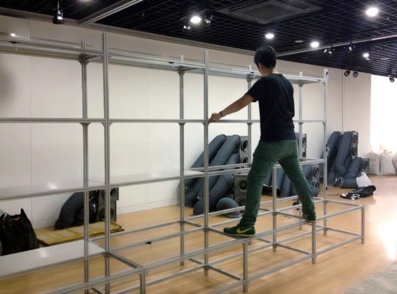

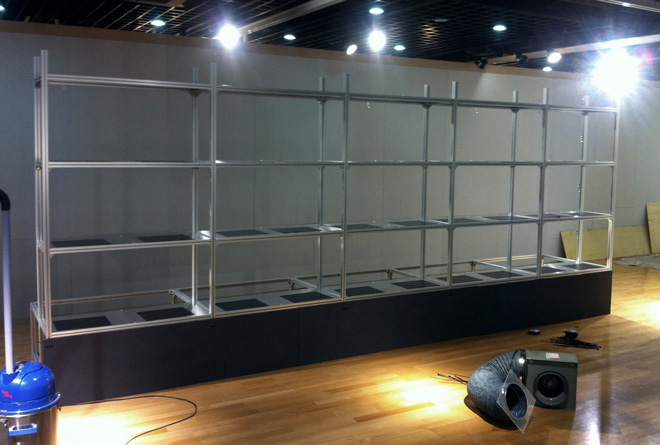

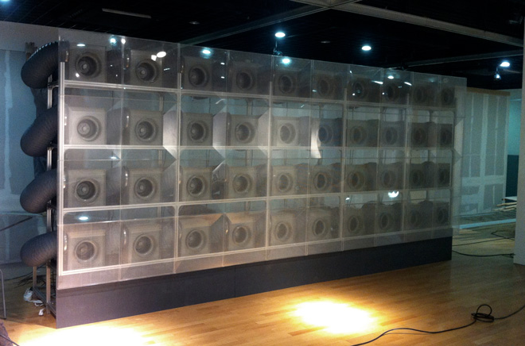

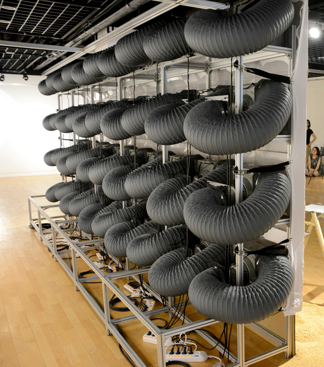

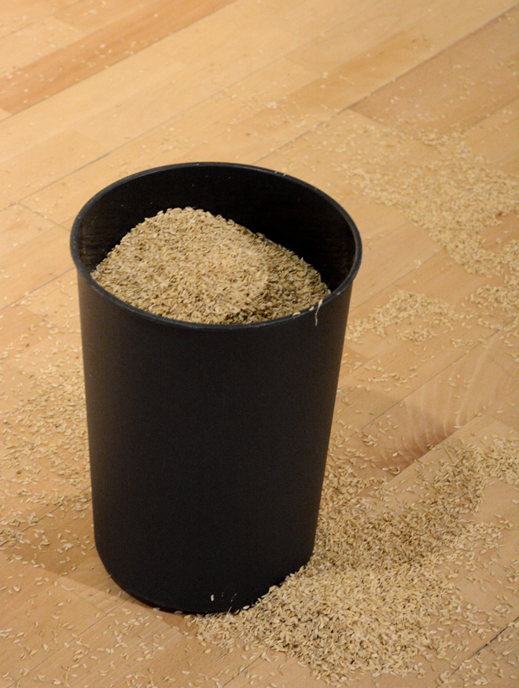

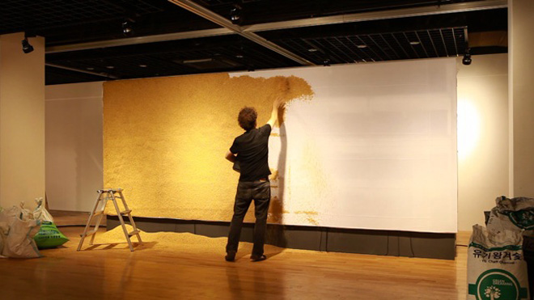

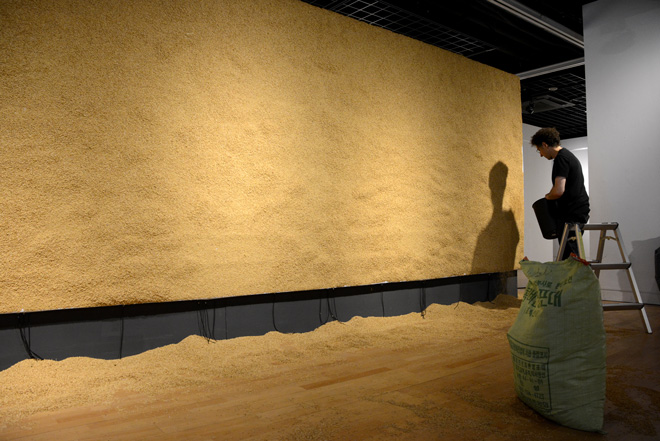

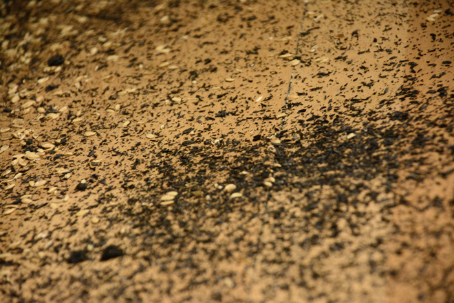

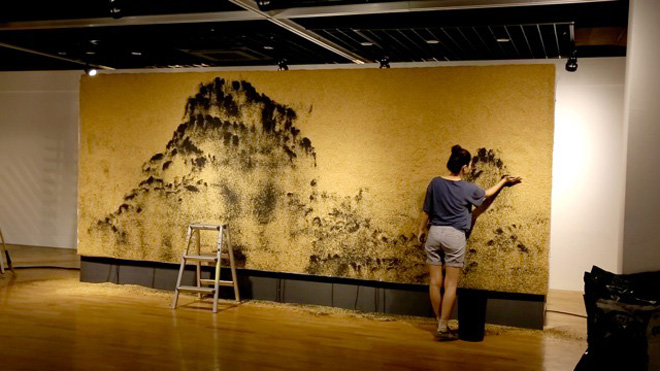

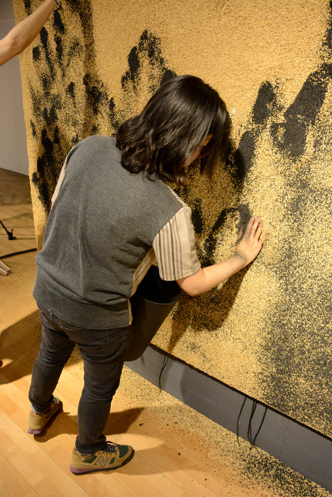

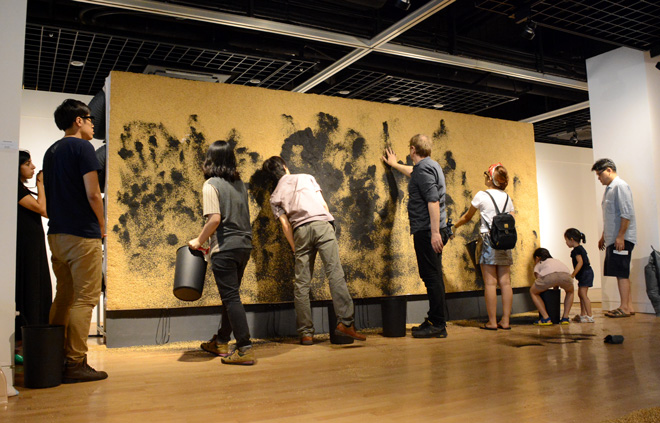

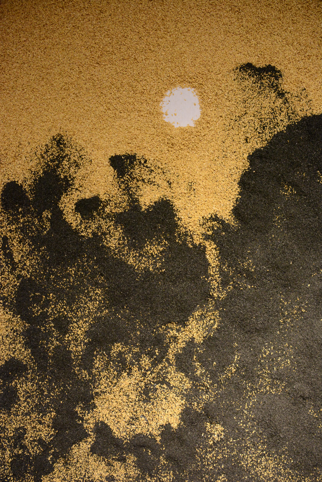

### Work Process: Krapp's Last Tape (2012)

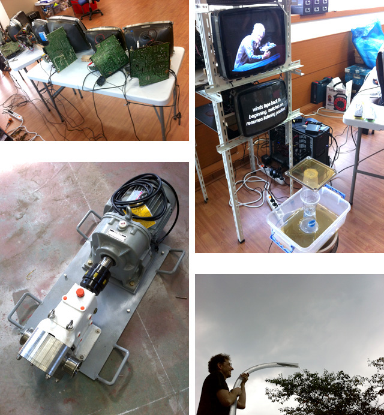
CRT disassembly and re-arrangement

Pump and the power test

Honey flow test from 5m height
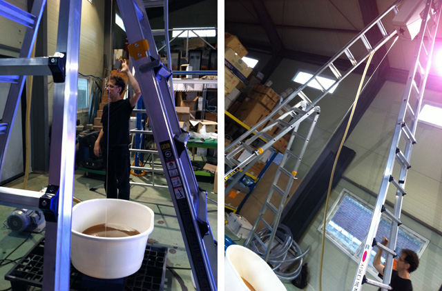

Carpentering and staining
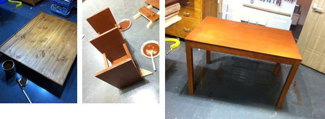

Designing the mechanism of the top container
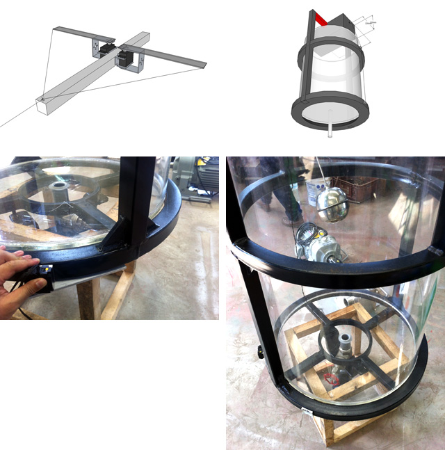

Construction of the metal frame and the stage
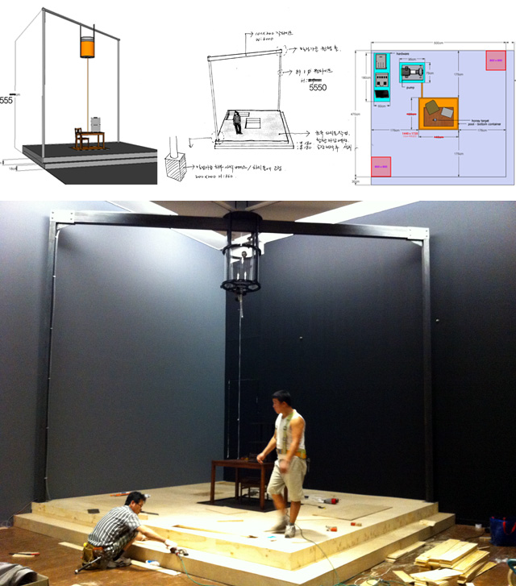

Pump Automation Circuit (Arduino, Processing)
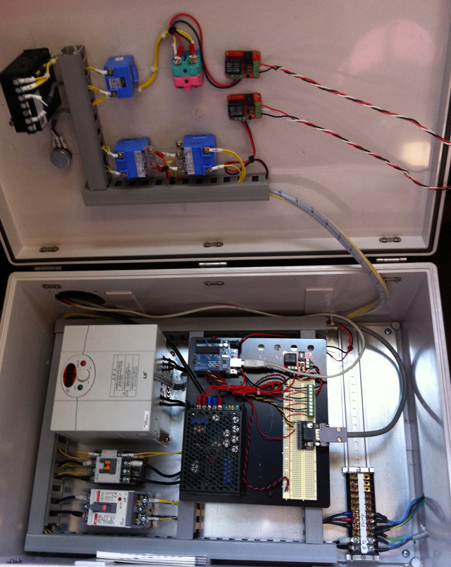
