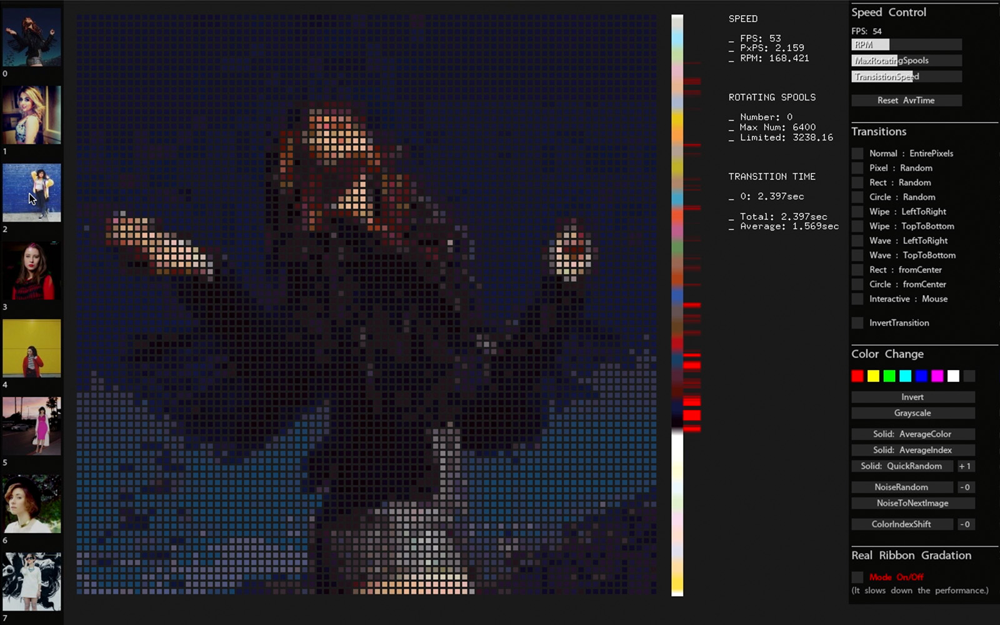
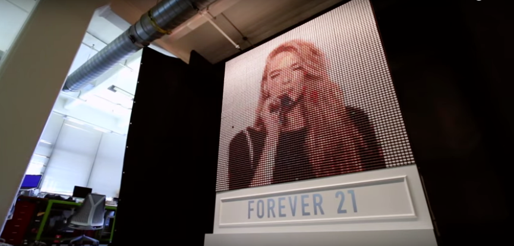
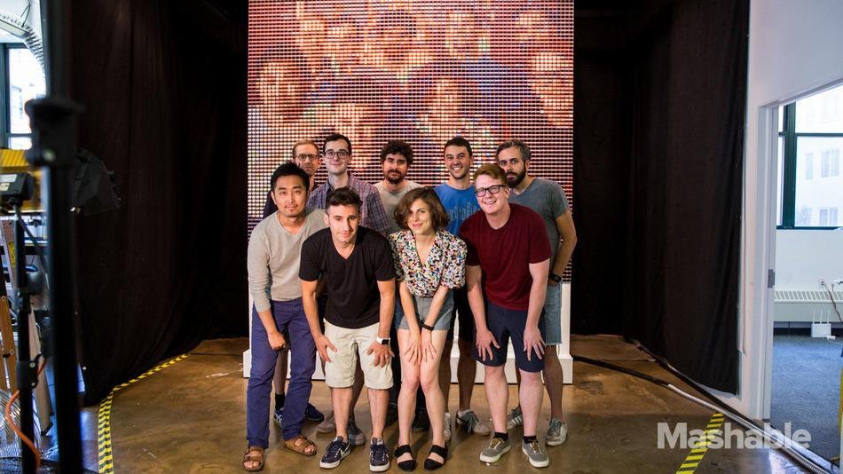
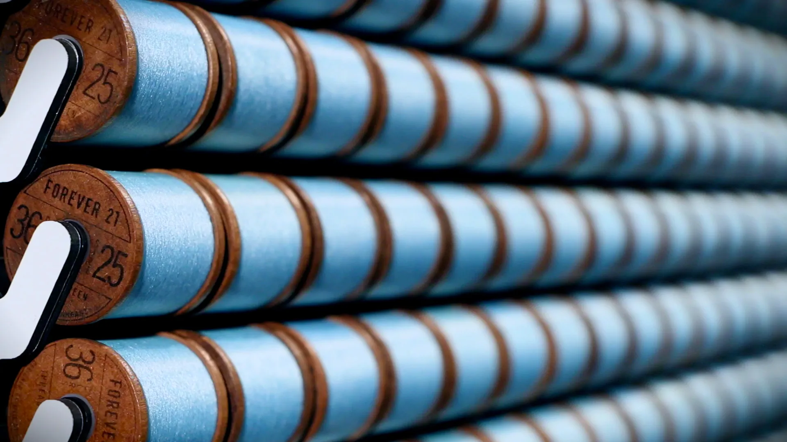
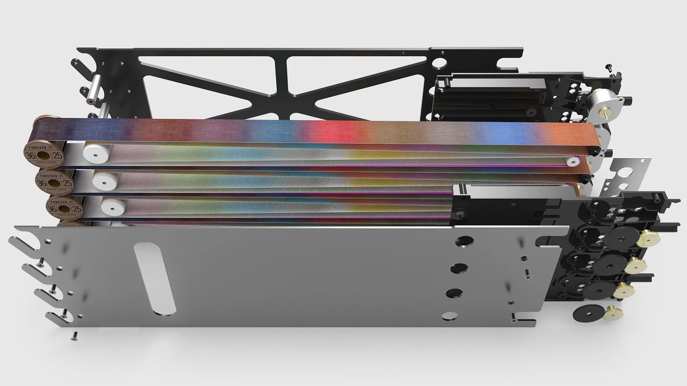
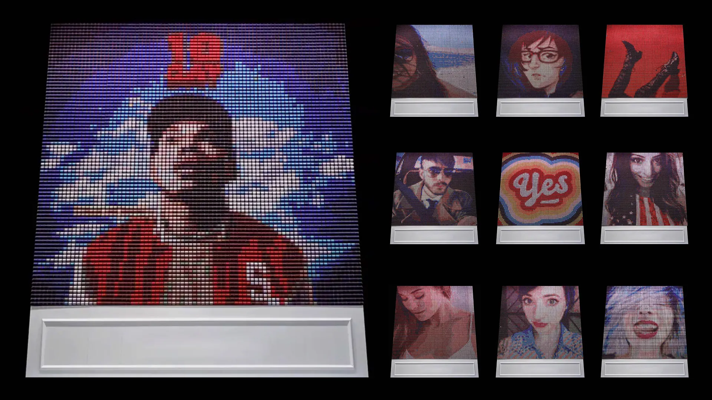

<iframe width="800" height="450" src="//www.youtube.com/embed/uNYBruk-A10?feature=player_detailpage" frameborder="0" allowfullscreen></iframe>

While interning at BREAKFAST, I created this simulator a year and a half before the actual installation was built. The images were sourced from Instagram, and selecting an image causes each pixel, representing threads, to change. In the actual installation, various colorful ribbons located on the right side of the thread's center were used. Physical elements, such as the RPM of the rotating ribbons, were also calculated. Through this simulation, we were able to experiment with various transitions, and all team members became excited about the possibilities of the project.

**Tool**: OpenFrameworks, based on C++

<iframe width="800" height="450" src="//www.youtube.com/embed/u5NLGrD3KNc?feature=player_detailpage" frameborder="0" allowfullscreen></iframe>

---

#### From BREAKFAST Website:

<iframe width="800" height="450" src="//www.youtube.com/embed/8xhWB2HWbV0?feature=player_detailpage" frameborder="0" allowfullscreen></iframe>

Link to the project: [Thread Screen](https://www.breakfastny.com/work/thread-screen)

**Thread Screen**

Fabric, Aluminium, Acetal, Mechanical Motor System, Software, Computer
13 x 10 x 2 ft.
Executed in 2015

Temporary Installation in Brooklyn, NY

The Thread Screen is a kinetic installation composed of 6,400 mechanical spools of thread that rotate through 36 colors to display images posted on Instagram from around the world. It stands over 13' tall and weighs over 2,000 pounds.

The artwork was commissioned by Forever 21. It symbolizes the convergence of Fashion, Technology, and Art, and puts creative control into the hands of their community. By adding the associated hashtag to an Instagram, the image would be sent to the screen and initiate a sequence made up of patterns, their username, and their image. The display was installed in Brooklyn, NY, and live-streamed twenty-four hours a day for seven days.

The Thread Screen is perhaps one of the most technically complex installations ever created. It was made from over 200,000 parts, all of which were designed from scratch by BREAKFAST, along with all the software to drive, process, and maintain the display.

Image Credit: [BREAKFAST](https://breakfaststudio.com/works/thread-screen)

