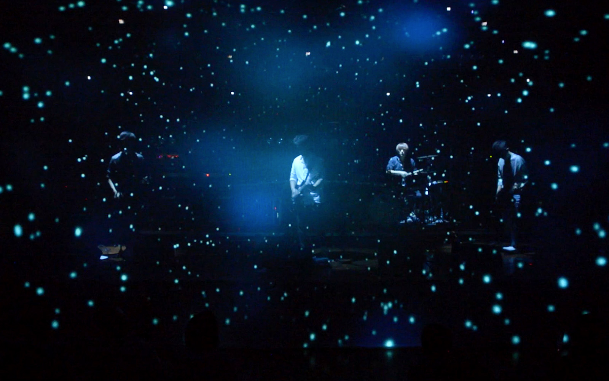

**Venue**: Chang-dong Platform 61, Seoul, Korea  
**Collaboration**: Wings of the Isang  
**Roles**: Art Direction, Visual Art & Creative Coding, Operation Direction

#### Project Description

Sponsored by Seoul City, a large-scale live concert was developed. Instead of a typical performance playing a music video, interaction technology and cutting-edge media were implemented. Not only were pre-made high-quality visuals controlled, but visuals like _Void Circle_ ([Link](https://www.youtube.com/watch?v=8u_lFPT48_I)) were drawn in real-time using a custom-built programming system. Additional videos can be found here: [2016 Showcase](https://www.youtube.com/playlist?list=PLSIzOgCcEvNwW_z5NVbH_PdxsjCIJzz4d) | [2017 Performance](https://www.youtube.com/playlist?list=PLSIzOgCcEvNzATRPGeZOn5UitQqi80XpG)

- **Roles**: Art Direction, Visual Art & Creative Coding, Intermedia Operation Direction
- Interactive concert combining pre-made visuals and real-time graphics.
- Developed custom visual effects like _Void Circle_.
- Integrated interaction technology and cutting-edge media.

#### Supplemental Videos

- ["In a Moment and Eternity"](https://www.youtube.com/playlist?list=PLSIzOgCcEvNzFkMc9a-m146XACwsFxIuA)
- ["Stream of Consciousness"](https://www.youtube.com/playlist?list=PLSIzOgCcEvNwW_z5NVbH_PdxsjCIJzz4d)

### Performance Images

The interactive visuals and lighting effects were controlled in real-time.

## 14th Korean Music Awards 2017

**Award**: Best Modern Rock Album Winner - _Stream of Consciousness_ by Wings of the Isang

Since 2013, collaborations with the band “Wings of the Isang” have led to innovative performances, music videos, album covers, and graphic designs, culminating in this prestigious award.

  

