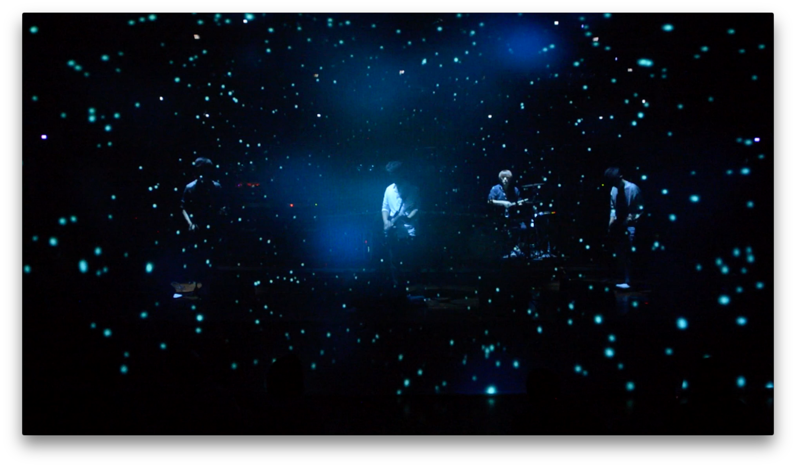

<iframe width="800" height="450" src="//www.youtube.com/embed/EWHcW4i7lKY?feature=player_detailpage" frameborder="0" allowfullscreen></iframe>
<iframe width="800" height="450" src="//www.youtube.com/embed/xglnhOfC3Fw?feature=player_detailpage" frameborder="0" allowfullscreen></iframe>
<iframe width="800" height="450" src="//www.youtube.com/embed/dcOQKDCJrnk?feature=player_detailpage" frameborder="0" allowfullscreen></iframe>
<iframe width="800" height="450" src="//www.youtube.com/embed/xb1afM46Vbs?feature=player_detailpage" frameborder="0" allowfullscreen></iframe>

## Interactive Media + Live Performance with Wings of the Isang

- **Performance**: 'In a Moment and Eternity', Chang-dong Platform 61, Seoul, Korea | Jan 19, 2019
- **Development**: Since 2016
- **Event**: Interactive Media Live Concert
- **Roles**: Art Direction, Visual Art & Creative Coding, Intermedia Operation Direction

Sponsored by Seoul City, a large-scale live concert was developed. Instead of a typical performance playing a music video, interaction technology and cutting-edge media were implemented. Not only were pre-made high-quality visuals controlled, but visuals like _Void Circle_ ([Link](https://www.youtube.com/watch?v=8u_lFPT48_I)) were drawn in real-time using a custom-built programming system. Additional videos can be found here: [2016 Showcase](https://www.youtube.com/playlist?list=PLSIzOgCcEvNwW_z5NVbH_PdxsjCIJzz4d) | [2017 Performance](https://www.youtube.com/playlist?list=PLSIzOgCcEvNzATRPGeZOn5UitQqi80XpG)

### Performance Images

The interactive visuals and lighting effects were controlled in real-time by myself.

## Interactive Media + Live Performance, Wings of the Isang Album Showcase

**Event**: Chang-dong Platform 61, Seoul, Korea | August 5, 2017  
**Roles**: Art Direction, Visual Art & Creative Coding, Operation Direction

Sponsored by Seoul City, this concert incorporated interaction technology and cutting-edge media. High-quality visuals like _Void Circle_ ([Link](https://www.youtube.com/watch?v=8u_lFPT48_I)) were drawn in real time using a custom-built programming system.

  
  

## 14th Korean Music Awards 2017

**Award**: Best Modern Rock Album Winner - _Stream of Consciousness_ by Wings of the Isang

Since 2013, collaborations with the band “Wings of the Isang” have led to innovative performances, music videos, album covers, and graphic designs, culminating in this prestigious award.

  

## **Interactive Media + Live Performance: Wings of the Isang**

**Date**: January 19, 2019  
**Venue**: Chang-dong Platform 61, Seoul, Korea  
**Collaboration**: Wings of the Isang

### Highlights

- Interactive concert combining pre-made visuals and real-time graphics.
- Developed custom visual effects like _Void Circle_.
- Integrated interaction technology and cutting-edge media.

### Supplemental Videos

- ["In a Moment and Eternity"](https://www.youtube.com/playlist?list=PLSIzOgCcEvNzFkMc9a-m146XACwsFxIuA)
- ["Stream of Consciousness"](https://www.youtube.com/playlist?list=PLSIzOgCcEvNwW_z5NVbH_PdxsjCIJzz4d)

---
